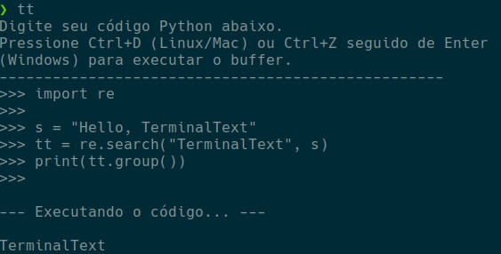

# TerminalText 

**TerminalText** é um editor de texto simples e direto para a linha de comando. Ele permite que você edite textos diretamente no terminal, sem precisar abrir editores externos como Nano ou Vim. Ideal para desenvolvedores que precisam escrever um trecho de código para teste de funcionalidades simples rapidamente. 

## Funcionalidade
- Editar texto diretamente no terminal.
- Sem necessidade de programas adicionais ou interfaces gráficas.
- Permite salvar e executar o código ao final da edição.

## Exemplo de execução



## Como Usar

1. Após a instalação, abra o terminal.
2. Digite o comando `tt` para iniciar o editor.
3. Digite o código ou texto desejado diretamente no terminal.
4. Para salvar e sair, pressione a combinação de teclas definida (ex: `Ctrl+C`).

## Instalação

1. Baixe o script `tt` e mova-o para um diretório acessível no seu sistema (ex: `/usr/local/bin`).
2. Torne o script executável:
   ```bash
   sudo chmod +x /usr/local/bin/tt

## Contribuição

Sinta-se à vontade para contribuir com melhorias ou correções. Para contribuir, siga os passos abaixo:

1. Faça um fork do projeto.
2. Crie uma branch para sua feature ou correção.
3. Envie um pull request.

## Licença

Este projeto está licenciado sob a Licença MIT - veja o arquivo LICENSE para mais detalhes.
